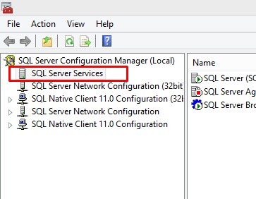
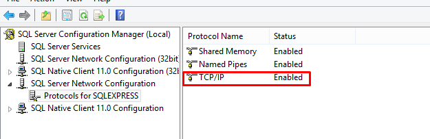
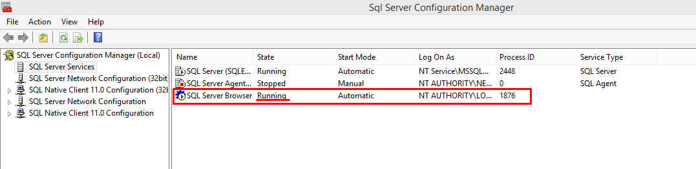
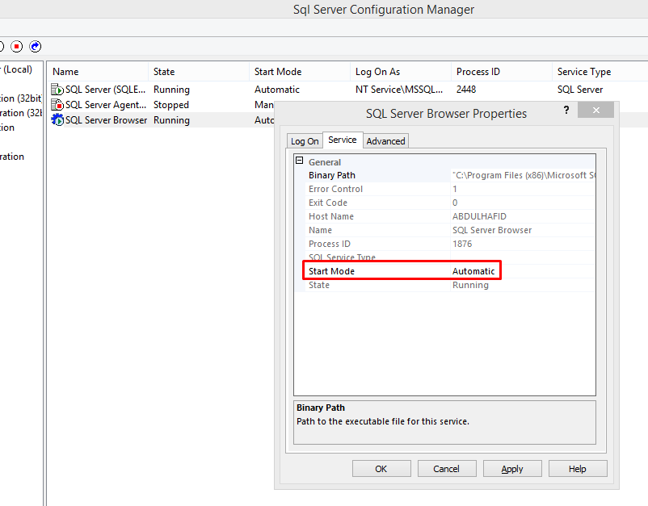
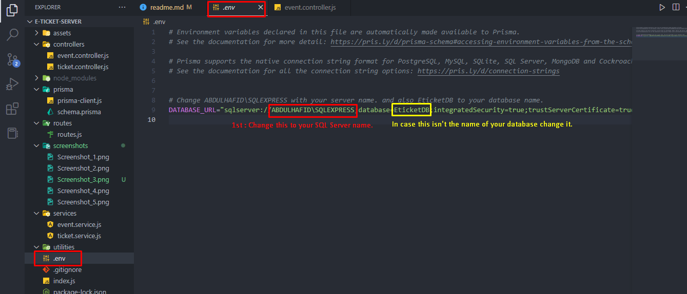

# Prisma setup instructions
### First let's make sure SQL Server browser is running and TCP/IP is enabled (this took me a lot of time to figure out).
- Open the SQL Server Configuration Manager.
- Choose SQL Server Servics from side bar.
  
- Check if this enabled.
  
  - if not right click > Enable.
  
- If SQL Server Browser is running you can skip the next sub steps and go straight ************
  
  - Right click > Properties
  - Choose service tab
  - Put this option on Automatic
  

### Now go run the script that's in assets folder (assets/script.sql) in your SQL Server.
 
 <span style="color:red; font-weight:bold">NOTE:</span> <span style="font-weight:bold">It's different than Ayoub's one as i've added a primary key for Paid_Tickets_Orders so prisma stops complaining about it. So please make sure you run my script instead.</span> 

And also make sure the database name is called EticketDB to make stuff easy for yourself. or you can change the database name in .env file in the e-ticket-server to match your database name.

### Go change these stuff to match yours.
- Open .env file in the backend root folder (e-ticker-server).
 

### Run the next following commands. (Please make sure you open command line (cmd) in the e-ticket-server).
- 1st:
```
npx prisma db pull 
```
- 2nd:
```
npx prisma generate
```

### Build and Run instructions
- Open a command line prompt (cmd) in e-ticket-server (root backend folder).
- Run the following command:
```
npm install
```

```
node .
```
( ```node .``` is equivalent to ```node index.js``` )

### Now the server should be running in ```localhost:4000```.
- This is just the main page of the api (You can change the port in index.js in case you get some port issues I put it in 4000 so it doesnt conflict with react one in port 3000).

- Example :
```localhost:4000/api/events```

### Also you can run prisma studio and get rid of the ugly SQL Server Management.
- Run this command to run the prisma studio:
  
  ```
  npx prisma studio
  ```
- If it didn't open it automatically in your browser. open this in your browser.
  ```
  localhost:5555


# Some command that I used :
  npx prisma db push  ----> to refrech the database in planetscale when I made any changes in the schemas .
  npm start       ----> just simple command to start the server I added it in the package.json in scripts part.
  npx prisma migrate 
  npx prisma migrate dev  ---> to apply the changes for schema to database;
  


